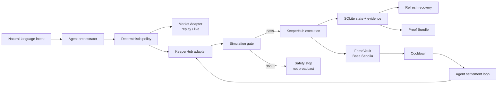

# FOMO Firewall

> A behavioral policy layer for agentic wallets: users define rules while calm, deterministic policies constrain risky intent, and KeeperHub executes the protection with verifiable onchain evidence.

FOMO Firewall 是一个面向加密资产用户的链上行为防火墙。当用户在资产快速上涨后产生追涨意图时，Agent 会按照用户预先设定的规则判断风险，并通过 KeeperHub 将准备投入的测试 USDC 锁入冷静期保险箱。冷静期结束后，系统把“立即买入的假设结果”与“受到保护的真实结果”并排展示，并通过 KeeperHub 执行退款。

## 当前状态

项目已完成可运行的 Hackathon MVP：包含 Foundry 合约、确定性 Policy、自然语言意图解析、Next.js Demo、KeeperHub 真实锁仓与退款流程、SQLite 状态恢复、自动结算 Agent loop 和可下载 Proof Bundle。

提交截止前的最低完成标准：

- Agent 能解释为什么一笔交易触发了用户预设规则。
- KeeperHub 在 Base Sepolia 上执行至少一笔真实交易。
- 页面展示 KeeperHub execution ID、交易哈希和区块浏览器链接。
- GitHub 仓库、Demo 视频和真实交易链接三项齐全。

当前验证状态：Foundry 合约测试通过；Next.js `npm run typecheck` 通过；Base Sepolia 已完成 approve、lock、refund 三笔真实交易。

## 评委 60 秒导览

1. 在页面输入一笔冲动购买意图，确定性 Policy 对比 `Observed` 与 `Your rule`。
2. 点击保护后，KeeperHub 对 approve 和 lock 分别执行 **simulation → broadcast → terminal verification**。
3. 每个 execution ID 在等待终态前写入 SQLite；断网或刷新后恢复同一执行，不会创建第二笔交易。
4. 冷静期结束后 Demo Agent loop 自动调用服务端 settlement，由 KeeperHub 预演并执行 refund。
5. 下载 Proof Bundle，独立核验 policy、行情来源、execution ID、交易哈希、verified receipt 和最近三笔真实交易。

项目不是价格预测器。Agent 只能提出和解释动作；资金参数由版本化规则、地址白名单和合约时间锁共同约束。

## 一句话机制

```text
暴涨后产生买入意图
→ Agent 判断是否违反预设纪律
→ KeeperHub 预演并锁定测试 USDC
→ SQLite 持久化并恢复执行状态
→ 冷静期后 Agent loop 自动结算
→ KeeperHub 预演并退款
→ 对比“如果追涨”与“实际受到保护”的结果
```

## 系统架构



## MVP 边界

MVP 只演示一个可重复、可验证的场景：

- 单一资产：ETH 价格场景。
- 单一链：Base Sepolia，chain ID `84532`。
- 单一资金资产：Base Sepolia 测试 USDC。
- 单一规则：1 小时涨幅达到 `15%` 且投入金额达到最低保护金额时，100% 进入冷静仓。
- Demo 配置：最低保护金额为 `1 USDC`，用于避免测试网水龙头额度限制；正式产品规则建议恢复为 `50 USDC` 或更高。
- 单一结局：冷静期结束后 Agent 判断取消，并通过 KeeperHub 退款。
- 行情使用明确标注的历史回放；锁仓和退款使用真实测试网交易。

MVP 不执行真实 DEX Swap，不预测价格，不提供投资建议，也不使用主网资金。

## 文档

| 文档 | 用途 |
|---|---|
| [产品需求文档](docs/PRD.md) | 用户、问题、产品机制、范围、需求与验收标准 |
| [技术设计](docs/TECHNICAL_DESIGN.md) | 架构、Agent 决策、合约、KeeperHub 执行、安全与测试 |
| [开发计划](docs/DEVELOPMENT_PLAN.md) | 文件结构、实现顺序、时间安排和验证方法 |
| [提交清单](docs/SUBMISSION_CHECKLIST.md) | 主赛道必备材料、证据和 Demo 录制检查 |

## 已实现技术栈

- Next.js + TypeScript：单页 Demo 与服务端 Agent。
- Foundry + Solidity：`FomoVault` 合约、测试和部署。
- KeeperHub Direct Execution REST API：预演、广播、重试保护和状态查询。
- Base Sepolia：真实测试网执行。
- SQLite 状态与证据：保存 intent、执行步骤、execution ID、交易哈希和 verified 状态。
- Market Adapter：支持 `historical_replay` 与 Coinbase `live` 模式；默认使用历史回放。
- 自动结算：Demo 页面监控链上冷静期，结束后调用服务端 Agent settlement；失败时保留手动重试入口。
- Proof Bundle：按 intent 导出可复核 JSON，并附带 SHA-256 bundle hash 与最新三笔交易。
- 规则解析器：MVP 使用可测试的中英文规则解析；LLM 可作为后续替换层，不能直接决定资金动作。

## 快速开始

要求：Node.js 24+（SQLite 使用 Node 内置模块）、npm、Foundry，以及 KeeperHub 组织 API key。

```bash
npm install
cp .env.example .env
npm run dev
```

在 `.env` 中填写服务端配置：

```env
KEEPERHUB_API_KEY=kh_...
KEEPERHUB_WALLET_ADDRESS=0x...
KEEPERHUB_BASE_URL=https://app.keeperhub.com/api
BASE_SEPOLIA_RPC_URL=https://base-sepolia-rpc.publicnode.com
BASE_SEPOLIA_CHAIN_ID=84532
BASE_SEPOLIA_USDC_ADDRESS=0x036CbD53842c5426634e7929541eC2318f3dCF7e
FOMO_VAULT_ADDRESS=0x08A95642925831C507051ECf46586e357c7182b1
MARKET_MODE=historical_replay
DEMO_AUTO_SETTLE=true
```

然后打开 <http://localhost:3000>。Demo 流程为：

```text
Evaluate intent
→ 5 秒 Demo 观察倒计时
→ Protect with FOMO Firewall
→ approve + createIntent
→ 约 16 秒链上执行缓冲/冷静期
→ Agent 自动触发 refund
→ FOMO Receipt
```

执行按钮会真实调用 KeeperHub；请只使用 Base Sepolia 测试币。

合约测试：

```bash
forge test
npm test
npm run typecheck
npm run build
```

`npm test` 覆盖意图解析、Policy 边界、Agent 解释以及 SQLite 的幂等写入、刷新恢复、自动结算候选查询和 Proof Bundle。

当前本地验证基线：13 个应用测试、7 个 Foundry 合约测试全部通过，生产构建和 TypeScript 检查通过，`npm audit` 无已知漏洞。

## 部署与链上地址

| 项目 | 地址 |
|---|---|
| Network | Base Sepolia (`84532`) |
| FomoVault | [`0x08A95642925831C507051ECf46586e357c7182b1`](https://sepolia.basescan.org/address/0x08A95642925831C507051ECf46586e357c7182b1) |
| Test USDC | [`0x036CbD53842c5426634e7929541eC2318f3dCF7e`](https://sepolia.basescan.org/token/0x036CbD53842c5426634e7929541eC2318f3dCF7e) |

## 真实交易证据

以下交易由 KeeperHub 组织钱包在 Base Sepolia 执行并验证：

- [USDC approve](https://sepolia.basescan.org/tx/0x11d5a0ebf4d9bc4ce78ecdfe3057f3063ee11ab37b927115d6dccec69d8ec0a5) · execution ID `t3keq600j6apb5ibvg87b`
- [Vault lock / createIntent](https://sepolia.basescan.org/tx/0x272f808e6c057df0ea205e059e8d8e4b47104f4bac34b3071f40ef34716abcac) · execution ID `xyyj3ytpazsj5iaoxk3qv`
- [Vault refund](https://sepolia.basescan.org/tx/0x85cc55de01f476ae7868ed6ef19928cd17e6a8755ee1b644133416e35604d9ad) · execution ID `dscug75pah1esj73bq6uc`

结构化证据保存在 [public/evidence/transactions.json](public/evidence/transactions.json)。
运行后的 intent 与最新执行步骤保存在本地 `data/fomo-firewall.db`，该文件不会提交到 Git。

## KeeperHub 为什么不可替代

KeeperHub 不只是代替钱包发交易。MVP 使用完整的安全写入链路：

1. 使用相同请求体预演交易。
2. 只有 `success=true` 且 `wouldRevert=false` 才允许广播。
3. 使用按业务动作持久化的稳定重试键，避免未知结果下重复执行。
4. 保存 `executionId` 并查询最终状态。
5. 展示交易哈希、交易链接和链上回执证据。

项目还将每次 KeeperHub simulation 与最终 execution 保存在同一个步骤证据中。若 simulation 失败，API 返回 `SIMULATION_REJECTED`、`broadcasted=false`，页面展示 `SAFETY STOP · NOT BROADCAST`，证明失败交易没有进入广播阶段。

## 可靠性状态机

```text
EVALUATED
  → APPROVAL_PENDING → APPROVAL_COMPLETE
  → LOCK_PENDING     → LOCKED
  → REFUND_PENDING   → REFUNDED
                     ↘ FAILED
```

- 同一页面动作复用保存在浏览器中的 `requestId`。
- 业务重试键固定为 `fomo:<intentId>:<step>`。
- KeeperHub 返回 execution ID 后立即落库，再开始轮询。
- 重复请求先恢复已有 execution，不会换键重发。
- SQLite 使用 WAL、外键和按 intent 的步骤 upsert。
- `GET /api/intents/latest` 恢复最近一次流程。
- `GET /api/evidence/:intentId` 下载不可混淆的执行证据。

## 从 Demo 到真实产品

当前 Demo 使用单一 KeeperHub 组织钱包与 Base Sepolia 测试币。生产接入需要：每用户智能账户或受限 session key、合约级额度/协议白名单、独立身份授权、托管数据库、后台队列，以及 KeeperHub Schedule/Event Workflow 来取代页面内的倒计时触发。核心边界保持不变：Agent 是 proposer，确定性 Policy 是 gate，KeeperHub 是 execution and reliability layer，合约是最终资金约束。

参考：

- [KeeperHub Hackathon Quickstart](https://docs.keeperhub.com/quickstart)
- [KeeperHub Direct Execution API](https://docs.keeperhub.com/api/direct-execution)
- [KeeperHub MCP Server](https://docs.keeperhub.com/ai-tools/mcp-server)
- [KeeperHub Chains API](https://docs.keeperhub.com/api/chains)

## 安全声明

FOMO Firewall 是黑客松原型，不提供财务或投资建议。历史回放只用于稳定演示产品机制，不代表未来市场表现。所有开发和演示交易应限制在 Base Sepolia 测试网。
