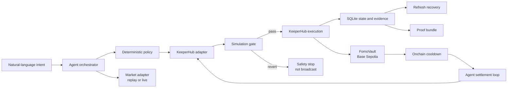

# FOMO Firewall

> A behavioral policy layer for agentic wallets. Users set rules while calm, deterministic policy constrains risky intent, and KeeperHub executes the protection with verifiable onchain evidence.

FOMO Firewall turns an impulsive ETH purchase into a time-delayed, auditable decision. When a user's intent breaches a precommitted chasing rule, the agent does more than display a warning. It uses KeeperHub to simulate and lock test USDC in a Base Sepolia vault, waits through a cooldown, and automatically returns the funds.

The market story is a clearly labeled historical replay. The approve, lock, and refund transactions are real Base Sepolia executions.

## Why this exists

Most trading safeguards act after a user has already decided to trade. FOMO Firewall moves the safeguard into the execution path:

```text
Impulse
  -> explainable policy decision
  -> simulation gate
  -> onchain cooldown
  -> automatic settlement
  -> verifiable receipt
```

It does not predict the market. The agent proposes and explains an action; deterministic policy, allowlisted contracts, KeeperHub simulation, and the vault contract constrain what can move funds.

## 60-second judge tour

1. Enter `ETH is pumping and I want to buy with 1 USDC`.
2. Compare the observed `+24%` move with the user's `+15%` rule.
3. Click **Protect with FOMO Firewall**.
4. Watch KeeperHub simulate, execute, and verify USDC approval and vault lock.
5. See each KeeperHub execution ID and BaseScan transaction link.
6. Let the agent loop automatically refund the USDC after the cooldown.
7. Download the proof bundle and verify the policy, market snapshot, execution IDs, transaction hashes, and bundle hash.

Refresh the page at any point. SQLite restores the latest intent and resumes from the persisted execution instead of sending a duplicate transaction.

## Where KeeperHub fits

KeeperHub is the execution and reliability layer, not the policy engine and not the vault.

| Layer | Responsibility |
|---|---|
| FOMO Firewall agent | Parses intent, gathers evidence, explains the result, and orchestrates the lifecycle |
| Deterministic policy | Decides `ALLOW` or `BLOCK_AND_COOLDOWN` from validated integer inputs |
| KeeperHub | Simulates, broadcasts, deduplicates, tracks, and verifies approve, lock, and refund calls |
| FomoVault | Enforces ownership, custody, cooldown, and one-time refund onchain |
| SQLite evidence store | Recovers in-progress work and builds a portable proof bundle |

The MVP uses the [KeeperHub Direct Execution REST API](https://docs.keeperhub.com/api/direct-execution). Every write follows this path:

```text
same contract call
  -> simulate: true
  -> reject safely if it would revert
  -> broadcast with a stable Idempotency-Key
  -> persist executionId before polling
  -> wait for terminal status
  -> expose the transaction and receipt
```

This is the key KeeperHub integration. A plain wallet library could sign a call, but it would not provide this shared simulation, idempotency, execution tracking, and evidence surface.

## Architecture



See [Technical Design](docs/TECHNICAL_DESIGN.md) for trust boundaries, API contracts, persistence, failure recovery, and production migration.

## What is implemented

- Next.js 16 and TypeScript application with server-side agent routes
- Foundry and Solidity `FomoVault` contract
- English and Chinese deterministic intent parser
- Versioned, integer-only policy engine
- Historical replay and Coinbase live market adapters
- KeeperHub simulation, execution, status polling, and stable idempotency keys
- Real Base Sepolia approve, lock, and refund transactions
- SQLite lifecycle persistence and refresh recovery
- Automatic demo settlement after the onchain cooldown
- Downloadable `fomo-firewall-proof/v1` JSON bundle
- Explicit `SAFETY STOP · NOT BROADCAST` evidence for rejected simulations
- Responsive judge-facing interface with execution ID copy controls and BaseScan links

## Demo scope

The MVP deliberately keeps one path small enough to be reproducible and easy to audit:

- Asset scenario: ETH
- Network: Base Sepolia, chain ID `84532`
- Protected asset: Base Sepolia test USDC
- Policy: protect 100% when the one-hour move is at least 15% and the amount reaches the configured minimum
- Demo minimum: 1 USDC to accommodate faucet limits
- Settlement rule: refund after cooldown
- Market source: labeled historical replay by default, with an optional Coinbase live adapter

The MVP does not execute a DEX swap, use mainnet funds, predict prices, or provide investment advice.

## Quick start

### Prerequisites

- Node.js 24 or later
- npm
- Foundry
- A KeeperHub organization API key and funded Base Sepolia organization wallet

### Install and run

```bash
npm install
cp .env.example .env
npm run dev
```

Configure `.env` with server-side values:

```env
KEEPERHUB_API_KEY=kh_...
KEEPERHUB_BASE_URL=https://app.keeperhub.com/api
KEEPERHUB_WALLET_ADDRESS=0x...
BASE_SEPOLIA_CHAIN_ID=84532
BASE_SEPOLIA_USDC_ADDRESS=0x036CbD53842c5426634e7929541eC2318f3dCF7e
FOMO_VAULT_ADDRESS=0x08A95642925831C507051ECf46586e357c7182b1
BASE_SEPOLIA_RPC_URL=https://...
MARKET_MODE=historical_replay
DEMO_AUTO_SETTLE=true
```

Open <http://localhost:3000>.

The write buttons call KeeperHub and create real testnet transactions. Use Base Sepolia assets only. Never expose the API key or a private key in the browser.

### Demo lifecycle

```text
Evaluate intent
  -> 5-second observation countdown
  -> protect with FOMO Firewall
  -> KeeperHub approve and createIntent
  -> onchain cooldown plus execution buffer
  -> agent automatically calls refund through KeeperHub
  -> FOMO Receipt and proof bundle
```

## Verified onchain evidence

These transactions were executed by the KeeperHub organization wallet on Base Sepolia:

| Step | KeeperHub execution ID | Transaction |
|---|---|---|
| USDC approve | `t3keq600j6apb5ibvg87b` | [View on BaseScan](https://sepolia.basescan.org/tx/0x11d5a0ebf4d9bc4ce78ecdfe3057f3063ee11ab37b927115d6dccec69d8ec0a5) |
| Vault lock | `xyyj3ytpazsj5iaoxk3qv` | [View on BaseScan](https://sepolia.basescan.org/tx/0x272f808e6c057df0ea205e059e8d8e4b47104f4bac34b3071f40ef34716abcac) |
| Vault refund | `dscug75pah1esj73bq6uc` | [View on BaseScan](https://sepolia.basescan.org/tx/0x85cc55de01f476ae7868ed6ef19928cd17e6a8755ee1b644133416e35604d9ad) |

Static submission evidence is available in [public/evidence/transactions.json](public/evidence/transactions.json). Each new run is also stored in the ignored local database at `data/fomo-firewall.db` and can be exported from `/api/evidence/{intentId}`.

## Deployed contracts

| Resource | Address |
|---|---|
| Network | Base Sepolia (`84532`) |
| FomoVault | [`0x08A95642925831C507051ECf46586e357c7182b1`](https://sepolia.basescan.org/address/0x08A95642925831C507051ECf46586e357c7182b1) |
| Test USDC | [`0x036CbD53842c5426634e7929541eC2318f3dCF7e`](https://sepolia.basescan.org/token/0x036CbD53842c5426634e7929541eC2318f3dCF7e) |

## Safety and recovery

```text
EVALUATED
  -> APPROVAL_PENDING -> APPROVAL_COMPLETE
  -> LOCK_PENDING     -> LOCKED
  -> REFUND_PENDING   -> REFUNDED
                      -> FAILED
```

- A browser-generated `requestId` remains stable across retries.
- Business idempotency keys use `fomo:<intentId>:<step>`.
- Each KeeperHub execution ID is persisted before status polling starts.
- Repeated requests recover existing executions instead of changing keys and rebroadcasting.
- A failed simulation is stored with `broadcasted: false`.
- The settlement service verifies the current vault state before refunding.
- SQLite uses foreign keys, WAL mode, and one updatable execution record per intent step.
- The proof bundle includes the latest three onchain transactions and a SHA-256 hash over the bundle payload.

## Application API

| Endpoint | Purpose | Writes onchain? |
|---|---|---|
| `POST /api/intents/evaluate` | Parse intent, read market data, and evaluate policy | No |
| `POST /api/intents/execute` | Recover or execute KeeperHub approve and lock | Yes |
| `POST /api/intents/settle-due` | Recover or execute the due refund | Yes |
| `POST /api/intents/refund` | Manual retry path for a specific refund | Yes |
| `GET /api/intents/latest` | Restore the latest local lifecycle | No |
| `GET /api/evidence/{intentId}` | Download the proof bundle | No |

## Tests and validation

```bash
forge fmt --check
forge test
npm test
npm run typecheck
npm run build
npm audit --audit-level=high
```

Current local baseline:

- 13 application tests passing
- 7 Foundry contract tests passing
- TypeScript check passing
- Next.js production build passing
- 0 known npm vulnerabilities

GitHub Actions runs the Node and Foundry checks for every push and pull request.

## From demo to production

The demo uses one KeeperHub organization wallet and local SQLite. A production deployment should add:

1. Per-user smart accounts or narrowly scoped session keys
2. Contract, protocol, asset, and amount allowlists
3. Authenticated intent ownership and tenant isolation
4. Managed PostgreSQL with transactional step claims
5. A durable queue and worker for settlement
6. A KeeperHub schedule or event workflow that triggers settlement while the page is closed
7. Reconciliation against both KeeperHub status and onchain state
8. Audited token handling, rate limits, alerting, and incident controls

The core boundary remains the same: the agent proposes, deterministic policy gates, KeeperHub executes and tracks, and the contract enforces custody.

## Documentation

- [Technical Design](docs/TECHNICAL_DESIGN.md)
- [English Demo Script](docs/DEMO_SCRIPT.md)

Internal planning documents remain in Chinese and are intentionally separated from the judge-facing reading path:

- [Internal Product Requirements](docs/PRD.md) (Chinese)
- [Internal Development Plan](docs/DEVELOPMENT_PLAN.md) (Chinese)
- [Internal Submission Checklist](docs/SUBMISSION_CHECKLIST.md) (Chinese)

## Official references

- [KeeperHub overview](https://docs.keeperhub.com/intro/overview)
- [KeeperHub Hackathon Quickstart](https://docs.keeperhub.com/quickstart)
- [KeeperHub Direct Execution API](https://docs.keeperhub.com/api/direct-execution)
- [KeeperHub MCP Server](https://docs.keeperhub.com/ai-tools/mcp-server)
- [KeeperHub Chains API](https://docs.keeperhub.com/api/chains)

## Disclaimer

FOMO Firewall is a hackathon prototype. It does not provide financial or investment advice. Historical replay data exists only to make the product mechanism reproducible and does not represent future market performance. All development and demo transactions must remain on Base Sepolia.
