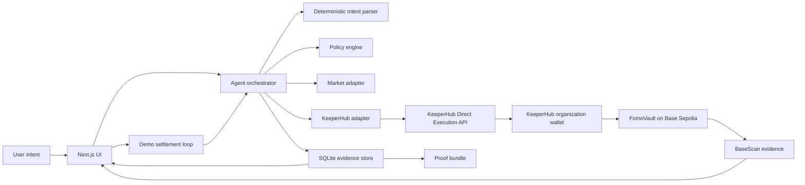
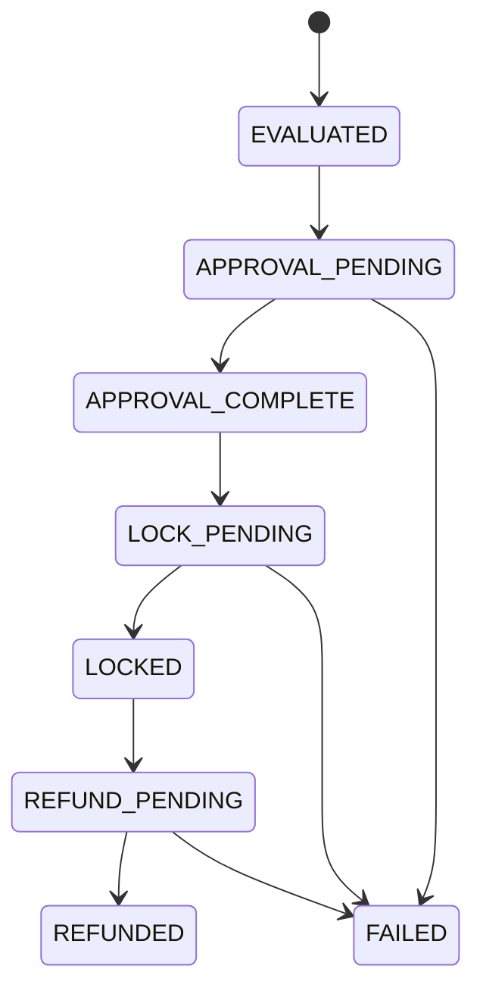

# FOMO Firewall Technical Design

## 1. Scope

This document describes the implemented hackathon MVP. The system evaluates a purchase intent against a versioned behavioral policy, uses KeeperHub Direct Execution to protect test USDC on Base Sepolia, persists every execution step, automatically settles the vault after its cooldown, and produces a portable proof bundle.

The design has one goal: let an agent act on an explainable rule without giving a language model unrestricted control over funds.

### Implemented boundary

- One intent type: buy ETH with USDC
- One test network: Base Sepolia (`84532`)
- One custody contract: `FomoVault`
- One policy outcome that moves funds: `BLOCK_AND_COOLDOWN`
- One settlement outcome: `refund_after_cooldown`
- Historical replay by default, optional Coinbase live market data
- One KeeperHub organization wallet for the demo

The MVP does not execute a swap or use mainnet funds.

## 2. Architecture



### Component ownership

| Component | Owns | Must not own |
|---|---|---|
| Demo UI | Intent entry, confirmation, lifecycle, evidence display | API keys or transaction signing |
| Intent parser | Asset, amount, and action extraction | Policy or contract selection |
| Policy engine | A single deterministic action from validated inputs | Price prediction or generated calldata |
| Market adapter | Timestamped replay or live snapshot | Fund movement decisions |
| Agent orchestrator | Observe, decide, act, verify sequence | Policy bypasses |
| KeeperHub adapter | Simulation, broadcast, idempotency, and status tracking | Product policy |
| SQLite store | Recovery state, executions, and proof material | Private keys |
| FomoVault | Custody, cooldown, owner-only refund | Swaps or market logic |

## 3. Decision model

### Observe

The agent reads:

- Parsed user intent
- Versioned policy
- Market snapshot and source
- KeeperHub wallet USDC balance
- Existing SQLite lifecycle state
- Current onchain vault state during settlement

### Decide

The policy is a pure function over integer values:

```ts
type Decision =
  | { action: "ALLOW"; reasonCodes: string[] }
  | {
      action: "BLOCK_AND_COOLDOWN";
      protectedAmount: bigint;
      reasonCodes: string[];
    };
```

The current rule is:

```text
breached = priceChange1hBps >= maxChaseBps
           AND amountUsdc >= minimumGuardAmountUsdc

breached ? BLOCK_AND_COOLDOWN : ALLOW
```

USDC values use six-decimal base units. Percentages use basis points. Floating-point values never control fund movement.

### Act

For `BLOCK_AND_COOLDOWN`, the orchestrator:

1. Reuses any persisted intent or execution state.
2. Reads the KeeperHub wallet USDC balance.
3. Simulates `USDC.approve(vault, exactAmount)`.
4. Broadcasts approval with a stable idempotency key.
5. Persists the execution ID and waits for terminal status.
6. Computes an unlock timestamp with an execution buffer.
7. Simulates `FomoVault.createIntent(...)`.
8. Broadcasts the lock with a stable idempotency key.
9. Persists and verifies the terminal result.

### Settle

After the cooldown, the settlement service:

1. Loads the persisted run.
2. Returns the previous result if refund already completed.
3. Reads `FomoVault.getIntent(intentId)` through KeeperHub.
4. Confirms the intent is still `LOCKED` and the onchain cooldown has elapsed.
5. Simulates `refund(intentId)`.
6. Broadcasts with the persisted refund idempotency key.
7. Saves the result as `REFUNDED`.

The page triggers this service automatically in the MVP. Production requires a durable server-side trigger so settlement continues after the page closes.

## 4. Trust boundary

```text
Untrusted
  user text, browser requests, optional LLM output, market responses
      |
      v
Schema and range validation
      |
      v
Deterministic policy
      |
      v
Chain, contract, asset, function, and amount allowlists
      |
      v
KeeperHub simulation and stable idempotency key
      |
      v
Base Sepolia receipt and FomoVault state
```

The MVP parser is local and deterministic. A future LLM parser may return an asset, user-stated amount, action, and explanation draft through the same schema. The server must ignore any model-generated chain ID, address, calldata, amount override, or idempotency key.

## 5. KeeperHub integration

### Why Direct Execution

The MVP uses KeeperHub Direct Execution REST because it exposes the controls needed for a reliable demo:

- Dry-run simulation with the same contract call
- Stable `Idempotency-Key` headers for writes
- Execution IDs that can be persisted before polling
- Terminal execution status and transaction links
- Server-only authentication with the organization API key

The application uses:

| Operation | KeeperHub endpoint |
|---|---|
| Contract read, simulation, or write | `POST /api/execute/contract-call` |
| Execution status | `GET /api/execute/{executionId}/status` |

MCP and visual Workflows are not in the local demo's critical path. A production deployment should use a KeeperHub schedule or event workflow to invoke settlement independently of the browser.

### Write protocol

Simulation and broadcast use the same call parameters. Broadcast removes `simulate` and adds a stable key:

```text
fomo:<intentId>:approve
fomo:<intentId>:lock
fomo:<intentId>:refund
```

The server does not broadcast unless simulation reports success and `wouldRevert` is false. A rejected simulation becomes a persisted failed step with `broadcasted: false` and appears in the UI as `SAFETY STOP · NOT BROADCAST`.

### Status handling

| Condition | Behavior |
|---|---|
| `pending` or `running` | Continue polling the saved execution ID |
| `completed` | Persist transaction evidence and advance state |
| `failed` | Stop automatic progression and expose the error |
| Network timeout | Recover the saved execution; retry only with the same key and body |
| Simulation revert | Persist rejection evidence and do not broadcast |
| HTTP `429` | Surface `Retry-After` for controlled retry behavior |

The current MVP polls every two seconds. A production client should honor KeeperHub's poll interval hint.

## 6. Lifecycle and idempotency



The browser creates a stable `requestId` after evaluation. The server derives:

```text
intentId = sha256("intent:" + requestId + ":" + sourceText)
```

Repeated execute requests look up this intent first. Existing completed steps are returned, pending execution IDs are polled, and no new key is generated. Each intent has at most one current database row for approve, lock, and refund.

## 7. Application API

| Endpoint | Input | Result | Onchain write |
|---|---|---|---|
| `POST /api/intents/evaluate` | Text and optional market snapshot | Parsed intent, snapshot, decision, explanation | No |
| `POST /api/intents/execute` | Text and stable request ID | Recovered or completed approve and lock | Yes |
| `POST /api/intents/settle-due` | Optional intent ID | Recovered or completed due refund | Yes |
| `POST /api/intents/refund` | Intent ID | Manual refund retry | Yes |
| `GET /api/intents/latest` | None | Latest persisted lifecycle for refresh recovery | No |
| `GET /api/evidence/{intentId}` | 32-byte hex intent ID | Downloadable JSON proof bundle | No |

All route handlers that access KeeperHub or SQLite run in the Node.js runtime. Zod validates external request bodies and intent IDs.

## 8. Persistence

The MVP uses Node's built-in SQLite module with foreign keys and WAL mode.

### `intents`

| Field | Purpose |
|---|---|
| `intent_id` | Deterministic primary key |
| `request_id` | Browser retry identity |
| `source_text` | Original user statement |
| `asset`, `amount_usdc` | Parsed intent |
| `decision`, `policy_version` | Policy result |
| `market_mode`, `market_source` | Snapshot provenance |
| `unlock_at` | Expected onchain unlock time |
| `evidence_hash` | Hash committed to FomoVault |
| `evaluation_json` | Serialized intent, market, decision, and explanation |
| `status` | Current lifecycle state |
| `created_at`, `updated_at` | Recovery ordering and audit timestamps |

### `execution_steps`

| Field | Purpose |
|---|---|
| `intent_id`, `step` | Parent lifecycle and approve, lock, or refund action |
| `execution_id` | KeeperHub execution or simulation-only identifier |
| `status` | Pending, running, completed, or failed |
| `transaction_hash`, `transaction_link` | Public chain evidence |
| `verified` | Receipt verification flag when available |
| `payload_json` | KeeperHub response, simulation, and broadcast flag |
| `created_at` | Evidence timestamp |

The database file and WAL files are ignored by Git. They contain runtime state, not credentials.

## 9. Proof bundle

`GET /api/evidence/{intentId}` returns `fomo-firewall-proof/v1` with:

- Network, chain, vault, USDC, and executor addresses
- Original intent and final lifecycle status
- Policy and market evaluation
- Onchain evidence hash
- KeeperHub surface and all execution steps
- Latest three transactions in the local evidence store
- SHA-256 `bundleHash` over the payload

The bundle makes the demo independently inspectable without treating a success toast as proof.

## 10. FomoVault

```solidity
enum IntentStatus { NONE, LOCKED, REFUNDED }

struct GuardedIntent {
    address owner;
    uint128 amount;
    uint64 createdAt;
    uint64 unlockAt;
    bytes32 evidenceHash;
    IntentStatus status;
}
```

Public interface:

```solidity
function createIntent(
    bytes32 intentId,
    uint256 amount,
    uint64 unlockAt,
    bytes32 evidenceHash
) external;

function refund(bytes32 intentId) external;
function getIntent(bytes32 intentId) external view returns (GuardedIntent memory);
```

Contract invariants:

- Intent IDs cannot be reused.
- Amount must be positive and fit in `uint128`.
- Unlock time must be in the future when the intent is created.
- `createIntent` pulls only the requested USDC amount.
- Only the recorded owner can refund.
- Refund cannot occur before `unlockAt`.
- Refunded intents cannot be refunded twice.
- State changes precede the external refund transfer.
- A non-reentrancy guard protects both write functions.
- There is no administrator withdrawal function.

The MVP uses a minimal ERC-20 interface and explicit return-value checks. A production contract should use audited token handling such as OpenZeppelin `SafeERC20` and receive an independent security review.

## 11. Market adapters

`MarketDataAdapter` exposes one method:

```ts
interface MarketDataAdapter {
  getSnapshot(asset: "ETH"): Promise<MarketSnapshot>;
}
```

- `HistoricalReplayAdapter` returns the reproducible `+24%`, `$3,200` scenario.
- `CoinbaseMarketAdapter` reads hourly `ETH-USD` candles and derives the latest one-hour move.
- `MARKET_MODE=historical_replay` is the safe demo default.
- Market failure must block new protection decisions. It must not block a valid post-cooldown refund.

## 12. Failure recovery

### Approval completed, lock did not complete

The persisted approval is reused. The application does not widen allowance by blindly approving again. A lock retry uses the same intent ID, call body, and idempotency key.

### Lock completed, client lost the response

The next request loads the saved execution ID and status. If KeeperHub already completed the lock, the application returns the recovered lifecycle instead of sending another call.

### Refund timed out

Settlement first reads the onchain intent. If it is already `REFUNDED`, the local lifecycle is repaired. If it remains `LOCKED` and is due, the saved refund execution or stable key is reused.

### Simulation failed

The failure is stored as a simulation-only execution step. The API returns `SIMULATION_REJECTED` and `broadcasted: false`; the UI shows that no transaction was sent.

### Market provider unavailable

The application must not create a new guarded intent without a valid snapshot. Already locked funds remain refundable after cooldown because settlement depends on vault state, not a new market decision.

## 13. Verification

### Application tests

- English and Chinese parser behavior
- Unsupported assets and malformed amounts
- Inclusive policy thresholds
- Allow and cooldown paths
- SQLite persistence, recovery, and step upsert
- Due-settlement lookup
- Proof bundle generation
- Simulation failure evidence

### Contract tests

- Successful lock
- Duplicate intent rejection
- Early refund rejection
- Non-owner refund rejection
- Successful post-cooldown refund
- Double refund rejection
- Oversized amount rejection

### Required commands

```bash
forge fmt --check
forge test
npm test
npm run typecheck
npm run build
npm audit --audit-level=high
```

Current baseline is 13 application tests and 7 Foundry tests, all passing.

## 14. Known limitations

- Historical replay proves the mechanism, not market prediction quality.
- Counterfactual value excludes fees, slippage, and market impact.
- The browser must remain open for the current automatic demo settlement trigger.
- SQLite is suitable for a local single-process demo, not multi-instance deployment.
- One KeeperHub organization wallet represents the demo user.
- `FomoVault` supports one configured test USDC token.
- The deployed contract is a hackathon prototype and has not been independently audited.

## 15. Production migration

Before real users or real funds:

1. Replace the shared organization wallet with per-user smart accounts or restricted session keys.
2. Authenticate every intent and enforce tenant-level data isolation.
3. Add contract, function, token, amount, and daily-spend policies.
4. Move lifecycle state to managed PostgreSQL with transactional claims.
5. Run settlement through a durable queue and KeeperHub schedule or event workflow.
6. Reconcile KeeperHub executions against onchain receipts and vault state.
7. Honor KeeperHub polling and rate-limit headers.
8. Add metrics, alerting, audit retention, and incident response controls.
9. Replace the minimal token helpers with audited libraries and complete a contract audit.

## 16. Design decisions

### Direct REST instead of MCP in the critical path

Direct REST makes simulation bodies, idempotency keys, execution IDs, and persistence explicit. This lowers demo integration risk. The tradeoff is that the demo does not show a model selecting MCP tools. KeeperHub still performs every onchain write and remains visible in the execution evidence.

### Deterministic policy for fund movement

Language models are useful for parsing and explanation but should not freely generate amounts, addresses, or calldata. Deterministic policy makes the decision testable, explainable, and reproducible.

### No real swap in the MVP

Testnet DEX routing and liquidity would increase failure surface without improving the proof of behavioral protection. The real onchain action is custody and refund. The hypothetical purchase exists only to communicate the avoided-loss scenario.

## 17. Official references

- [KeeperHub overview](https://docs.keeperhub.com/intro/overview)
- [KeeperHub Direct Execution API](https://docs.keeperhub.com/api/direct-execution)
- [KeeperHub MCP Server](https://docs.keeperhub.com/ai-tools/mcp-server)
- [KeeperHub Chains API](https://docs.keeperhub.com/api/chains)
- [KeeperHub Turnkey wallet](https://docs.keeperhub.com/wallet-management/turnkey)
- [KeeperHub Hackathon Quickstart](https://docs.keeperhub.com/quickstart)
