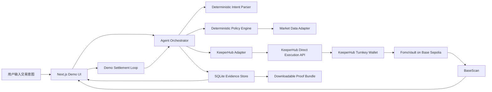
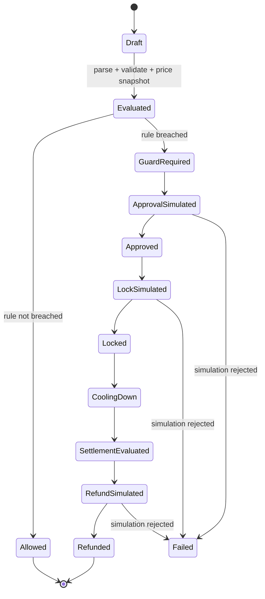

# FOMO Firewall 技术设计

## 1. 状态与范围

本文描述已实现的 Hackathon MVP。当前代码完成了 Policy、Market Adapter、KeeperHub Direct Execution、SQLite 恢复、自动结算入口、Proof Bundle、Foundry 合约与 Next.js UI。生产化扩展在各章节中单独标注。

技术目标只有一个：让 Agent 根据可解释规则，通过 KeeperHub 在 Base Sepolia 上可靠完成 USDC 授权、锁仓和退款，并为每一步保留可验证证据。

## 2. 架构



### 2.1 组件职责

| 组件 | 职责 | 不负责 |
|---|---|---|
| Demo UI | 收集规则和意图，展示双时间线与执行证据 | 直接持有 API key 或签名 |
| Intent Parser | 从中英文自然语言提取资产、金额和动作，生成严格结构 | 决定是否动用资金；生产版本可替换为受 schema 约束的 LLM parser |
| Policy Engine | 根据版本化规则输出唯一动作 | 预测价格或自由生成参数 |
| Market Adapter | 提供可追踪的实时或历史价格快照 | 决定交易 |
| Agent Orchestrator | 运行观察、判断、执行、验证循环 | 绕过安全条件 |
| KeeperHub Adapter | 预演、广播、状态查询、重试保护 | 修改 Agent 决策 |
| Evidence Store | 保存 intent、快照、重试键和交易证据 | 存储私钥 |
| FomoVault | 保管测试 USDC 并按时间条件退款 | Swap、价格判断或收益策略 |

## 3. 技术选择

### 3.1 Web 与 Agent

- Next.js App Router + TypeScript。
- 服务端 Route Handlers 承载 Agent 和 KeeperHub 调用。
- Zod 校验所有外部输入和 LLM 结构化输出。
- MVP parser 是本地、可测试的严格解析器，避免外部模型不稳定影响现场 Demo。生产版本可通过相同 schema 接入 LLM，但模型输出仍不能直接控制资金参数。

### 3.2 合约

- Solidity `^0.8.24`。
- Foundry 负责编译、测试和部署；使用 `forge` 编译测试，使用 `forge script` 部署，使用 `cast` 做链上读写验证。
- MVP 使用最小 ERC20 接口、返回值检查与显式 non-reentrancy guard；生产部署前应换成经审计的 OpenZeppelin `SafeERC20` 和 `ReentrancyGuard`。
- Base Sepolia chain ID `84532`。
- 测试 USDC 地址以 KeeperHub quickstart 当前公布值为准：`0x036CbD53842c5426634e7929541eC2318f3dCF7e`。部署前必须通过 Chains API 和链上 `decimals()` 再次验证。

### 3.3 KeeperHub Surface

MVP 使用 REST Direct Execution API，原因是：

- 可以显式执行预演。
- 可以控制并持久化 `Idempotency-Key`。
- 可以直接保存 `executionId`、状态和交易链接。
- 在 Next.js 服务端实现依赖最少。

主要端点：

| 用途 | 端点 |
|---|---|
| 查询支持链 | `GET /api/chains` |
| 合约读写与预演 | `POST /api/execute/contract-call` |
| 查询执行状态 | `GET /api/execute/{executionId}/status` |

MCP / Workflow 是生产后台自动化入口，不作为本地 Demo 的关键依赖。当前 Demo 使用 REST Direct Execution 以显式保存 simulation、稳定重试键和 execution ID；冷静期由页面 Agent loop 触发服务端 settlement。生产版本应由 KeeperHub Schedule/Event Workflow 调用 settlement endpoint，使页面关闭后仍能运行。

### 3.4 存储

MVP 使用本地 SQLite，保存执行恢复所需的最小数据。Demo 可本地运行，不把无持久磁盘的 Serverless 部署作为提交前依赖。

### 3.5 MVP 资金模型

MVP 不连接参赛观众的个人钱包。测试 ETH 和测试 USDC 预先存入 KeeperHub 组织的 Turnkey 钱包，所有合约交易的 `msg.sender` 和 Vault owner 都是该钱包地址。浏览器中的用户只提交并确认 Agent 意图。

这使 Demo 可以稳定证明 KeeperHub 的执行能力，但不代表正式产品的多用户资金隔离方案。正式版本需要为每位用户提供独立账户、委托权限或智能合约账户。

## 4. Agent 决策循环



### 4.1 Observe

读取：

- 用户确认后的结构化意图。
- 用户规则。
- 行情快照和来源。
- KeeperHub 钱包的 USDC 余额、ETH Gas 余额和 allowance。
- Vault 当前状态。

### 4.2 Decide

规则函数必须是纯函数：相同输入永远产生相同输出。

```ts
type Decision =
  | { action: "ALLOW"; reasonCodes: string[] }
  | { action: "BLOCK_AND_COOLDOWN"; amount: bigint; reasonCodes: string[] };
```

MVP 逻辑：

```text
breached = priceChange1hBps >= maxChaseBps
           AND amountUsdc >= minimumGuardAmountUsdc

breached ? BLOCK_AND_COOLDOWN : ALLOW
```

金额使用 USDC 最小单位整数；涨幅使用基点整数。不得使用浮点数做资金判断。

### 4.3 Act

当动作是 `BLOCK_AND_COOLDOWN`：

1. 检查固定链和合约白名单。
2. 预演 USDC `approve(vault, exactAmount)`。
3. 广播 approve。
4. 等待 approve 达到终态。
5. 预演 `createIntent`。
6. 广播 lock。
7. 等待 lock 达到终态。

### 4.4 Verify

每个写操作必须保存：

- KeeperHub execution ID。
- 状态。
- 交易哈希。
- 交易链接。
- 可用的 receipt 验证字段。
- Gas 使用量。
- 请求体哈希和重试键。

只有 KeeperHub 返回完成状态且链上状态与预期一致时，应用状态才能进入下一步。

### 4.5 Settle

MVP 的 settlement rule 固定为 `refund_after_cooldown`。冷静期结束后，Agent 读取第二个行情快照用于生成反事实结果，但不得根据该价格临时改变退款动作。这样可以保证 Demo 的资金路径可预测，并避免在没有真实 Swap 集成时假装完成买入。

## 5. FomoVault 合约

### 5.1 数据结构

```solidity
enum IntentStatus {
    NONE,
    LOCKED,
    REFUNDED
}

struct GuardedIntent {
    address owner;
    uint128 amount;
    uint64 createdAt;
    uint64 unlockAt;
    bytes32 evidenceHash;
    IntentStatus status;
}
```

### 5.2 公共接口

```solidity
function createIntent(
    bytes32 intentId,
    uint256 amount,
    uint64 unlockAt,
    bytes32 evidenceHash
) external;

function refund(bytes32 intentId) external;

function getIntent(bytes32 intentId)
    external
    view
    returns (GuardedIntent memory);
```

### 5.3 约束

- `intentId` 不能重复。
- `amount > 0`。
- `unlockAt > block.timestamp`。
- `createIntent` 使用 `safeTransferFrom` 收取 USDC。
- 只有 intent owner 可以调用 `refund`。
- `block.timestamp >= unlockAt` 后才能退款。
- 退款后状态永久为 `REFUNDED`，不能重复退款。
- 合约没有管理员提取用户资金的函数。
- 合约只接受构造函数指定的 USDC。

### 5.4 事件

```solidity
event IntentCreated(
    bytes32 indexed intentId,
    address indexed owner,
    uint256 amount,
    uint64 unlockAt,
    bytes32 evidenceHash
);

event IntentRefunded(
    bytes32 indexed intentId,
    address indexed owner,
    uint256 amount
);
```

### 5.5 Evidence Hash

`evidenceHash` 是以下规范化 JSON 的 SHA-256 或 keccak256：

```json
{
  "intentId": "demo-001",
  "asset": "ETH",
  "amountUsdc": "100000000",
  "priceUsd": "4200.00",
  "priceChange1hBps": 2400,
  "ruleVersion": "fomo-v1",
  "marketMode": "historical_replay",
  "observedAt": "2026-08-12T00:00:00Z"
}
```

链上只保存哈希，完整证据保存在本地数据库和提交材料中。生成哈希前必须固定字段顺序和数值字符串格式。

## 6. KeeperHub 安全写入流程

### 6.1 请求原则

预演和广播必须使用同一业务参数。广播时移除 `simulate`，并增加稳定重试键。

稳定重试键格式：

```text
fomo:<intentId>:approve:v1
fomo:<intentId>:lock:v1
fomo:<intentId>:refund:v1
```

重试键必须在第一次网络请求前写入数据库。同一键不得绑定不同请求体。

### 6.2 合约调用请求

计划中的请求形状：

```json
{
  "contractAddress": "<allowlisted-address>",
  "chainId": 84532,
  "functionName": "createIntent",
  "functionArgs": "[\"0x...\",\"100000000\",\"...\",\"0x...\"]",
  "abi": "<json-encoded-abi>",
  "simulate": true
}
```

真实实现必须使用 KeeperHub 运行时文档或 `tools_documentation` 再验证字段，不得只依赖本文示例。

### 6.3 状态处理

| 状态/错误 | 行为 |
|---|---|
| `pending` / `running` | 按 KeeperHub 提示间隔继续查询 |
| `completed` | 验证交易链接和链上 Vault 状态 |
| `failed` | 停止自动推进，展示错误和 request ID |
| 网络超时 | 先查已保存 execution ID；未知时用同一键和同一请求体重试 |
| `idempotency_in_progress` | 等待后使用相同键重试 |
| `idempotency_conflict` | 停止，比较已存请求体哈希，不得换键绕过 |
| `429` | 遵守 `Retry-After` |
| 预演会回滚 | 不广播，展示 revert reason |

## 7. 应用 API

### `POST /api/intents/evaluate`

输入：用户文本、规则和场景 ID。

输出：结构化意图、行情快照、规则判断、解释和待执行摘要。不产生链上写操作。

### `POST /api/intents/:id/execute`

要求用户已确认评估结果。执行 approve 和 lock 的 KeeperHub 安全写入流程。

### `GET /api/intents/:id`

返回 intent、双时间线、KeeperHub executions 和 Vault 状态。

### `POST /api/intents/:id/refund`

仅在冷静期结束、Vault 状态为 `LOCKED` 且 policy 输出 `REFUND` 时执行。

### `GET /api/scenarios/:id`

返回历史回放数据、来源和许可信息。MVP 可以内置一个固定场景。

## 8. 数据模型

### intents

| 字段 | 类型 | 说明 |
|---|---|---|
| id | text PK | 应用 intent ID |
| chain_id | integer | 固定 84532 |
| asset | text | 固定 ETH |
| amount_usdc | text | 最小单位十进制字符串 |
| status | text | 状态机当前状态 |
| rule_version | text | `fomo-v1` |
| evidence_hash | text | 链上证据哈希 |
| unlock_at | integer | Unix 时间 |
| created_at | integer | Unix 时间 |

### market_snapshots

保存 intent ID、价格、1 小时涨幅、时间、来源和 live/replay 模式。

### executions

保存业务动作、稳定重试键、请求体哈希、execution ID、状态、交易哈希、交易链接、错误和时间。

## 9. 信任边界

```text
不可信：用户文本、浏览器输入、LLM 输出、外部价格响应
   ↓ schema + range validation
可信决策层：版本化 Policy Engine
   ↓ address/amount/chain allowlist
可信执行层：KeeperHub Adapter
   ↓ simulation + stable retry key
链上事实：Base Sepolia receipt + FomoVault state
```

### LLM 限制

LLM 只能输出：

- 资产符号。
- 用户表达的金额。
- 用户动作类型。
- 面向用户的解释草稿。

服务端重新校验金额，并从白名单解析资产和地址。LLM 输出中出现的链、合约地址、交易 calldata 或重试键一律忽略。

## 10. 可观测性

前端执行时间线至少包含：

```text
1. Intent parsed
2. Rule evaluated
3. Approval simulated
4. Approval confirmed
5. Lock simulated
6. Funds locked
7. Cooldown complete
8. Refund simulated
9. Refund confirmed
```

每一步展示：开始时间、结束时间、状态、可读摘要。链上步骤额外展示 execution ID、交易哈希和外部链接。

日志不得包含 KeeperHub API key、模型 API key 或私钥。

## 11. 测试策略

### Policy 单元测试

- 涨幅低于阈值时允许。
- 涨幅等于阈值时触发。
- 金额低于最低保护金额时允许。
- 金额等于最低保护金额时触发。
- 非法负数、NaN、超大金额被拒绝。

### 合约单元测试

- 成功创建 intent。
- 重复 intent ID 回滚。
- 零金额和过去时间回滚。
- 冷静期前退款回滚。
- 非 owner 退款回滚。
- 成功退款后不能再次退款。
- 余额守恒。
- 恶意 ERC-20 回调不能重入。

### KeeperHub Adapter 测试

- 模拟成功后才能广播。
- 模拟会回滚时不广播。
- 超时重试复用相同键和请求体。
- 冲突时关闭执行。
- 状态达到终态后停止轮询。
- API key 不进入客户端 bundle 或日志。

### Base Sepolia 集成测试

- KeeperHub 钱包有 ETH 和测试 USDC。
- approve、lock、refund 均可在 BaseScan 打开。
- Vault 余额和 intent 状态与 UI 一致。
- 重复点击执行不会产生第二笔 lock。

## 12. 失败恢复

### approve 成功、lock 失败

保留精确 allowance，显示“资金尚未进入 Vault”。修复确定性错误后，可以用新的 lock 业务动作执行；不得重复 approve 扩大额度。

### lock 成功、客户端丢失响应

从本地执行记录恢复 execution ID；若没有收到 ID，则使用相同重试键和完全相同请求体恢复原结果。不得生成新键。

### refund 超时

先读取 Vault intent 状态。如果已经 `REFUNDED`，只恢复证据；如果仍是 `LOCKED`，再按相同重试键处理。

### 价格服务不可用

不得触发新的资金动作。已经锁仓的资金仍允许在冷静期结束后按合约规则退款。

## 13. 已知限制

- 历史回放证明的是产品机制，不证明策略能预测市场。
- 反事实价值不包含滑点、交易费和市场冲击。
- KeeperHub 模拟发送者必须与实际广播路径一致。MVP 使用 Turnkey EOA，并在首次执行前验证没有 Safe 路由差异。
- SQLite 适合本地 Demo，不适合多实例部署。
- FomoVault MVP 只支持一种测试 USDC。

## 14. 架构决策

### 使用 REST 而不是把 MCP 客户端放进关键路径

REST 更容易显式控制预演、稳定重试键和恢复逻辑，降低截止前集成风险。代价是 Demo 中看不到模型直接选择 MCP 工具。README 和 Demo 必须清楚说明 Agent 仍通过 KeeperHub 的 agent-native REST surface 执行。

### 不执行真实 Swap

测试网 DEX 流动性和路由会扩大失败面。MVP 把真实链上动作聚焦在保护资金，反事实买入只用于清楚展示产品价值。代价是产品愿景中的最终买入路径尚未实现。

### 使用确定性规则控制资金

模型适合解析和解释，不适合未经约束地决定金额和地址。这降低“AI 自主性”的表面效果，但让执行安全、可测试、可解释。

## 15. 官方技术依据

- [KeeperHub Direct Execution API](https://docs.keeperhub.com/api/direct-execution)
- [KeeperHub MCP Server](https://docs.keeperhub.com/ai-tools/mcp-server)
- [KeeperHub Chains API](https://docs.keeperhub.com/api/chains)
- [KeeperHub Turnkey Wallet](https://docs.keeperhub.com/wallet-management/turnkey)
- [KeeperHub Hackathon Quickstart](https://docs.keeperhub.com/quickstart)
